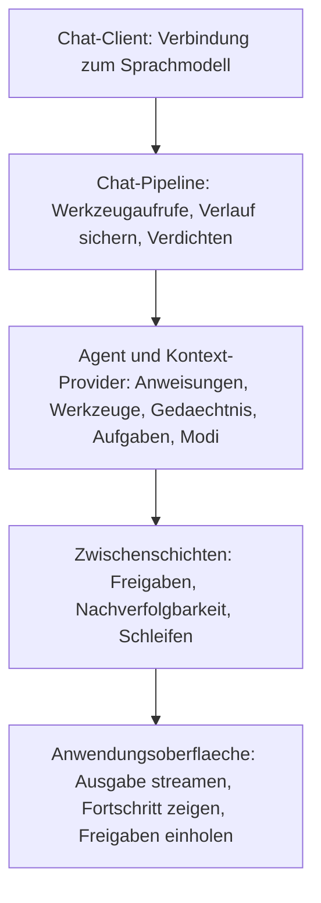
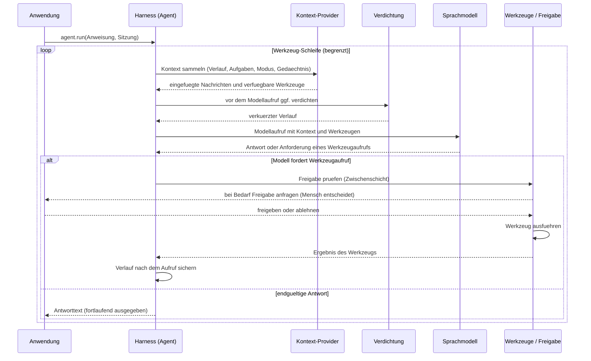
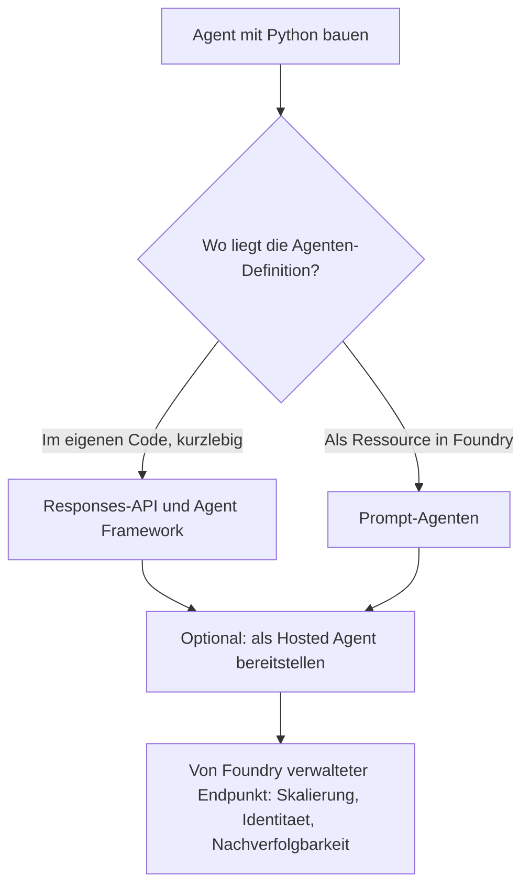
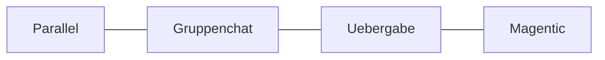

# Agent Harnessing mit Python und Microsoft Foundry

Schulungsunterlage – Stand: 2026-09-17

> **Hinweis zu den Fachbegriffen:** Die Begriffe *Harnessing*, *Agent Harness* und *Harness*
> werden bewusst in ihrer englischen Originalform verwendet, weil es keine etablierte deutsche
> Übersetzung gibt. Sinngemäß bedeutet *Harness* „Geschirr" oder „Gerüst": die Software-Hülle,
> die ein Sprachmodell erst zu einem handlungsfähigen Agenten macht. Alle übrigen Fachbegriffe
> werden bei der ersten Nennung erklärt; am Ende der Unterlage finden Sie zusätzlich ein Glossar.

---

## Lernziele

Nach dieser Einheit können die Teilnehmenden:

1. erklären, was ein **Agent Harness** ist und welches Problem er löst;
2. die zwei Betriebswege in Microsoft Foundry unterscheiden (im eigenen Code oder von Foundry
   verwaltet);
3. mit der Funktion `create_harness_agent` einen Agenten aufsetzen, der Werkzeuge, Aufgabenlisten,
   Freigaben und Nachverfolgbarkeit mitbringt;
4. die Zusammenarbeit mehrerer Agenten (Multi-Agent-Orchestrierung) einordnen;
5. einen Agenten als **Hosted Agent** (von Foundry gehosteter Agent) bereitstellen.

---

## 1. Was bedeutet „Harnessing"?

Ein **Agent Harness** ist die **Laufzeitumgebung** (englisch *runtime*), die aus einem reinen
Sprachmodell einen arbeitsfähigen Agenten macht. Ein Sprachmodell allein kann nur Text erzeugen.
Der Harness ergänzt alles, was nötig ist, damit daraus ein Agent wird, der eigenständig Aufgaben
bearbeitet. Er

- steuert die Aufrufe an das Modell und an externe **Werkzeuge** (englisch *tools*, aufrufbare
  Funktionen wie „Wetter abfragen" oder „Hotel buchen");
- verwaltet den Gesprächszustand und den Kontext (also die gesamte bisherige Unterhaltung);
- wendet Freigaberegeln an (welche Aktionen dürfen automatisch laufen, welche brauchen eine
  menschliche Bestätigung);
- hält den Agenten über **mehrstufige, länger laufende Aufgaben** hinweg am Laufen.

> Zitat aus der Microsoft-Learn-Dokumentation: *„An agent harness is the runtime scaffolding that
> turns a language model into an agent that can perform work."* (Sinngemäß: Ein Agent Harness ist
> das Laufzeitgerüst, das ein Sprachmodell in einen arbeitsfähigen Agenten verwandelt.)

Statt all diese Bausteine selbst zusammenzubauen, liefert das **Microsoft Agent Framework** einen
fertigen Harness mit sinnvollen Voreinstellungen. Man gibt lediglich einen **Chat-Client** vor
(die Verbindung zum Sprachmodell) und schaltet die benötigten Fähigkeiten hinzu.

### Wozu dient Harnessing? Ziele im Überblick

Ein blankes Sprachmodell beherrscht nur eine einzelne Frage-Antwort-Runde. Der Harness umschließt
den Chat-Client mit genau der Infrastruktur, die für **lange, mehrstufige Aufgaben** (Recherche,
Programmierung, Datenanalyse) nötig ist. Er verfolgt dabei diese Ziele:

- **Aus dem Modell einen handlungsfähigen Agenten machen** – Planung, Werkzeugnutzung und das
  eigenständige Abarbeiten mehrstufiger Aufgaben, statt nur Text zu erzeugen.
- **Integrationsaufwand senken** – der Ansatz ist „batteries-included": Man liefert nur einen
  Chat-Client und passt bloß die Fähigkeiten an, die die Anwendung wirklich braucht. Planung,
  Aufgabenlisten (Todos), Kontextverdichtung (englisch *compaction*), Datei-Gedächtnis, Freigaben
  und Nachverfolgbarkeit sind bereits eingebaut.
- **Verhalten vereinheitlichen und verlässlich machen** – dieselbe Orchestrierung (Modell- und
  Werkzeugaufrufe steuern, Zustand/Kontext verwalten, Freigaberegeln anwenden, den Agenten durch
  die Aufgabe *treiben*) wirkt über alle Anwendungen hinweg gleich.
- **Kompatibel bleiben** – das Ergebnis ist ein ganz normaler Agent (in Python das von
  `create_harness_agent` zurückgegebene `Agent`-Objekt), der dieselben Sitzungs- und
  Kontext-Bausteine nutzt wie jeder andere Agent.

> Zitat aus der Microsoft-Learn-Dokumentation: *„Agent Framework provides an opinionated,
> batteries-included Harness for research, coding, data analysis, and other long-running work. You
> provide a chat client and customize only the capabilities your application needs."*

Quelle: <https://learn.microsoft.com/agent-framework/concepts/harness>,
<https://learn.microsoft.com/agent-framework/get-started/harness>

---

## 2. Aufbau des Harness

Der Harness ist kein völlig neues System, sondern die **Zusammenschaltung bereits vorhandener
Bausteine**. Er verbindet fünf Schichten zu einem einzigen, normalen Agenten:



| Schicht | Aufgabe |
|---|---|
| **1. Chat-Client** | Verbindet den Agenten mit dem Sprachmodell (Foundry, Azure OpenAI oder OpenAI). |
| **2. Chat-Pipeline** | Führt Werkzeugaufrufe aus, fügt Nachrichten hinzu, sichert den Gesprächsverlauf nach jedem Modellaufruf und verdichtet ihn bei Bedarf. |
| **3. Agent und Kontext-Provider** | Steuern sitzungsbezogene Anweisungen, Werkzeuge, Gedächtnis, Aufgabenlisten und Betriebsmodi bei. |
| **4. Zwischenschichten** (englisch *middleware*) | Behandeln Freigaben, Nachverfolgbarkeit und optionale, begrenzte Wiederholungsschleifen. |
| **5. Anwendungsoberfläche** | Gibt Antworten fortlaufend aus, zeigt den Fortschritt und holt Eingaben wie Freigaben ein. |

Das Ergebnis bleibt ein **ganz normaler Agent** des Agent Frameworks: In Python ist es ein Objekt
vom Typ `Agent`, das die Funktion `create_harness_agent` zurückgibt; in .NET ein `HarnessAgent`.
Er nutzt dieselben Bausteine für Sitzung und Kontext wie jeder andere Agent auch.

Quelle: <https://learn.microsoft.com/agent-framework/concepts/harness>

---

## 2a. Zusammenhänge: Was geschieht bei einem Aufruf von `agent.run(...)`?

Die eigentliche Stärke des Harness liegt im **Zusammenspiel** der Bausteine innerhalb eines
einzigen Aufrufs. Ein Aufruf durchläuft eine Schleife aus drei Schritten – Kontext aufbauen,
Modell befragen, Werkzeug ausführen –, und zwar so lange, bis eine endgültige Antwort feststeht:



**Diese fünf Zusammenhänge sollten in der Schulung besonders betont werden:**

1. **Die Sitzung ist der verbindende Faden.** Plan, Aufgabenliste, Betriebsmodus und
   Gesprächsverlauf werden in der **Sitzung** (englisch *session*) gespeichert und überdauern
   einzelne Aufrufe. Deshalb wird bei jedem Aufruf dieselbe Sitzung übergeben. Ohne Sitzung würde
   der Harness bei jedem Aufruf sein Gedächtnis verlieren. Die standardmäßig aktive
   Freigabe-Zwischenschicht setzt eine Sitzung sogar zwingend voraus.
2. **Die Kontext-Provider laufen in einer festen Reihenfolge** und fügen *vor* jedem Aufruf ihre
   Beiträge hinzu: zuerst der Gesprächsverlauf, dann (optional) die Verdichtung, danach
   Aufgabenliste, Betriebsmodus und Datei-Gedächtnis. Eigene Provider werden zuletzt angehängt.
3. **Die Verdichtung sitzt mitten in der Pipeline**, nicht daneben: Sie kann *zwischen* zwei
   Modellaufrufen innerhalb einer langen Werkzeug-Schleife kürzen (Vorher-Phase) und den
   gespeicherten Verlauf nach dem Aufruf reduzieren (Nachher-Phase).
4. **Die Freigabe ist eine Zwischenschicht, kein Werkzeug.** Sie fängt Werkzeugaufrufe ab, wendet
   dauerhaft erteilte Freigaben und automatische Freigaberegeln an und gibt nur noch offene Fälle
   an die Anwendung zurück, damit ein Mensch entscheidet.
5. **Die Nachverfolgbarkeit liegt quer über allem:** Jeder Modell- und Werkzeugaufruf sowie jeder
   Ablaufschritt wird als Messpunkt (englisch *span*) protokolliert – standardmäßig eingeschaltet.

---

## 2b. Die Bausteine im Detail und wie sie zusammenwirken

### Sitzung und Sicherung des Gesprächsverlaufs

- Die **Sitzung** hält den vollständigen Zustand eines Gesprächs (Verlauf, Aufgabenliste, Modus).
- Der Harness sichert den Verlauf **nach jedem einzelnen Modellaufruf** innerhalb einer
  Werkzeug-Schleife, nicht erst am Ende. Dadurch geht bei einem Abbruch nichts verloren.
- In Python liegt der Aufgabenzustand standardmäßig im Speicher der Sitzung
  (`TodoSessionStore`). Alternativ kann er in eine Datei (`TodoFileStore`) oder einen eigenen
  Speicher ausgelagert werden.

Dokumentation: <https://learn.microsoft.com/agent-framework/concepts/agents/conversations/session>

### Kontext-Provider

- **Kontext-Provider** sind Bausteine, die vor jedem Aufruf zusätzliche Anweisungen, Nachrichten
  und Werkzeuge beisteuern und nach dem Aufruf den neuen Zustand wieder auslesen.
- Der Harness ordnet sie in dieser Reihenfolge an: **Verlauf → Verdichtung → Aufgabenliste →
  Betriebsmodus → Datei-Gedächtnis → eigene Provider**.
- Das Datei-Gedächtnis ist standardmäßig aktiv. Fähigkeiten (englisch *skills*), Dateizugriff,
  Hintergrund-Agenten und Shell-Zugriff sind bewusst abgeschaltet und müssen einzeln zugeschaltet
  werden.

Dokumentation: <https://learn.microsoft.com/agent-framework/concepts/agents/conversations/context-providers>

### Planung, Aufgabenlisten und Betriebsmodi

Zwei Provider treiben länger laufende Arbeit voran:

- Der **Aufgaben-Provider** (englisch *todo provider*) stellt dem Modell Werkzeuge bereit, um
  Aufgaben zu verwalten: `todos_add` (hinzufügen), `todos_complete` (abschließen),
  `todos_remove` (entfernen), `todos_get_remaining` (offene abrufen) und `todos_get_all` (alle
  abrufen). Die aktuelle Aufgabenliste wird vor jedem Aufruf eingefügt, damit der Agent offene
  Arbeit wieder aufnimmt.
- Der **Modus-Provider** kennt zwei Betriebsmodi:
  - **Planen** (englisch *plan*) ist der interaktive Modus: Der Agent analysiert die Anforderung,
    legt Aufgaben an, stellt Rückfragen, präsentiert einen Plan und fragt nach, bevor er den Modus
    wechselt.
  - **Ausführen** (englisch *execute*) ist der eigenständige Modus: Der Agent arbeitet den Plan ab,
    trifft bei Unklarheiten vernünftige Entscheidungen und schließt Aufgaben ab.
- Das Nachhalten von Aufgaben ruft den Agenten allein **nicht** erneut auf. Damit der Agent den
  Plan selbstständig bis zum Ende abarbeitet, kombiniert man es mit der **Wiederholungsschleife**
  (siehe unten).

Dokumentation: <https://learn.microsoft.com/agent-framework/agents/planning-and-todos>

### Verdichtung des Gesprächsverlaufs (englisch *compaction*)

Bei jeder Anfrage an ein Sprachmodell wird der **gesamte** bisherige Gesprächsverlauf
mitgeschickt. Ohne Verdichtung entstehen drei Probleme:

- **Grenze des Kontextfensters:** Jedes Modell kann nur eine begrenzte Menge Text auf einmal
  verarbeiten (gemessen in *Token*, also Wort- bzw. Zeichenbausteinen). Ein zu langer Verlauf
  sprengt diese Grenze und führt zu Fehlern.
- **Kosten:** Mehr mitgeschickter Text bedeutet mehr Token und damit höhere Kosten.
- **Antwortzeit:** Mehr Eingabetext verlangsamt die Antwort.

Die **Verdichtung** kürzt ältere Teile des Verlaufs gezielt, ohne wichtige Informationen zu
verlieren.

Wichtig: Verdichtung wirkt nur bei Agenten, die ihren Verlauf **selbst im Arbeitsspeicher**
halten. Wenn der Dienst den Kontext serverseitig verwaltet, hat sie keinen Effekt – zum Beispiel
bei:

- **Foundry-Agenten** (der Kontext wird auf dem Server verwaltet),
- der **Responses-API mit aktiviertem Speicher** (Voreinstellung),
- **Copilot-Studio-Agenten**.

Im Harness ist die Verdichtung **standardmäßig ausgeschaltet**. Sie schaltet sich ein, sobald
sowohl `max_context_window_tokens` (maximale Größe des Kontextfensters) als auch
`max_output_tokens` (maximale Antwortlänge) gesetzt sind. Dann greift die Standardstrategie
`ContextWindowCompactionStrategy` für die Vorher- und die Nachher-Phase.

> **Hinweis:** Das Verdichtungs-Framework ist in Python derzeit **experimentell**; die
> Verdichtungstypen werden aus `agent_framework` importiert. Die Funktion `create_harness_agent`
> selbst ist bereits freigegeben – experimentell sind darüber hinaus noch Hintergrund-Agenten,
> Dateizugriff und die Wiederholungsschleife.

| Strategie (Python) | Wie stark gekürzt wird | Erhalt des Kontexts | Braucht das Modell | Am besten geeignet für |
|---|---|---|---|---|
| `ToolResultCompactionStrategy` | gering | hoch | nein | umfangreiche Werkzeug-Ausgaben verdichten |
| `SelectiveToolCallCompactionStrategy` | gering bis mittel | mittel | nein | nicht mehr benötigte Werkzeug-Aufrufe entfernen |
| `SummarizationStrategy` | mittel | mittel | ja | lange Gespräche, bei denen der Zusammenhang wichtig bleibt |
| `SlidingWindowStrategy` | hoch | gering | nein | harte Obergrenze bei der Anzahl der Gesprächsrunden |
| `TruncationStrategy` | hoch | gering | nein | Notfall-Bremse beim Token-Budget |
| `TokenBudgetComposedStrategy` | einstellbar | je nach Zusammensetzung | je nach Zusammensetzung | mehrschichtige Kombination mehrerer Strategien |

Dokumentation: <https://learn.microsoft.com/agent-framework/concepts/agents/conversations/compaction>

### Werkzeug-Freigaben (Mensch in der Schleife)

Manche Aktionen sind folgenreich (zum Beispiel eine Buchung) und sollen erst nach menschlicher
Bestätigung ausgeführt werden. Dieses Muster heißt „Mensch in der Schleife" (englisch
*human-in-the-loop*).

- Ein Werkzeug wird mit `approval_mode="always_require"` (immer Freigabe erforderlich) markiert.
- Der Harness schaltet standardmäßig die Freigabe-Zwischenschicht `ToolApprovalMiddleware` ein.
  Sie sammelt mehrere Anfragen, wendet **dauerhaft erteilte Freigaben** aus früheren Antworten an
  und prüft **automatische Freigaberegeln** (`auto_approval_rules`), bevor sie eine Anfrage an die
  Anwendung zurückgibt.
- Die Zwischenschicht benötigt über alle Freigaberunden hinweg dieselbe **Sitzung**.
- Mit `disable_tool_auto_approval=True` entfernt man nur das automatische Freigabeverhalten – die
  grundsätzliche Freigabepflicht des Werkzeugs bleibt bestehen.
- **Wichtig beim Zurücksenden der Freigabe:** Mit einer Sitzung (und erst recht mit dem
  Foundry-Client, der den Verlauf serverseitig hält) sendet man nur die **Freigabe-Antwort**
  (`to_function_approval_response(True/False)`) in einer neuen `user`-Nachricht zurück. Die
  ursprüngliche Anfrage darf **nicht** erneut als `assistant`-Nachricht eingespeist werden – sie
  steckt bereits im gespeicherten Verlauf, und ein erneutes Einspeisen erzeugt einen doppelten
  Werkzeugaufruf ohne Ergebnis. Nur in den *zustandslosen* Doku-Beispielen (ohne Sitzung) wird der
  gesamte Kontext inklusive Anfrage in jeder Runde erneut mitgeschickt.

Dokumentation: <https://learn.microsoft.com/agent-framework/agents/tools/tool-approval>

### Wiederholungsschleife (englisch *looping*)

- Die Wiederholungsschleife ruft den Agenten so lange erneut auf, bis eine Abschlussbedingung
  erfüllt ist – etwa zur schrittweisen Verbesserung eines Ergebnisses, zum Abschließen aller
  Aufgaben oder zum Warten auf Hintergrundarbeiten.
- Sie muss **immer begrenzt** sein (englisch *bounded*), damit sie nicht endlos läuft. Die
  Voreinstellung liegt bei höchstens zehn Wiederholungen (`max_iterations=10`).
- Diese Funktion ist derzeit **experimentell**.

Dokumentation: <https://learn.microsoft.com/agent-framework/agents/looping>

### Nachverfolgbarkeit (englisch *observability*)

- Standardmäßig aktiv: Jeder Modell-, Werkzeug- und Ablaufschritt wird als Messpunkt
  protokolliert. Grundlage ist der offene Industriestandard **OpenTelemetry**.
- Die Einstellung `otel_provider_name` legt nur den Namen fest, unter dem die Messpunkte
  erscheinen. Wohin die Daten geschickt werden, entscheidet ein separat gewählter Empfänger
  (englisch *exporter*), zum Beispiel Aspire-Dashboard, Jaeger, Azure Monitor, MLflow oder
  Langfuse.

Dokumentation: <https://learn.microsoft.com/agent-framework/agents/observability>

---

## 3. Zwei Betriebswege mit Foundry



| Weg | Wann sinnvoll | Dokumentation |
|---|---|---|
| **Responses-API** (im eigenen Code, kurzlebig) | Die Agenten-Definition soll gemeinsam mit dem Anwendungscode versioniert werden. | <https://learn.microsoft.com/azure/foundry/agents/quickstarts/responses-api> |
| **Hosted Agents** (von Foundry gehostet) | Ein verwalteter Endpunkt (englisch *endpoint*, eine feste Adresse zum Aufrufen), den andere Anwendungen oder Agenten aufrufen. | <https://learn.microsoft.com/azure/foundry/agents/quickstarts/quickstart-hosted-agent> |
| **SDK-Überblick** | Orientierung über die verfügbaren Clients und Endpunkte. | <https://learn.microsoft.com/azure/foundry/how-to/develop/sdk-overview> |

*Kurzlebig (englisch* ephemeral*): Der Agent existiert nur während der Programmausführung im
Arbeitsspeicher und wird nicht dauerhaft in Foundry gespeichert.*

---

## 4. Praxis: Harness in Python

### 4.1 Einfachster Harness

```python
from agent_framework import create_harness_agent
from agent_framework.openai import OpenAIChatClient

agent = create_harness_agent(
    client=OpenAIChatClient(model="gpt-4o"),
)

session = agent.create_session()
response = await agent.run("Plane ein Wochenende in Seattle.", session=session)
print(response.text)
```

### 4.2 Mit Foundry-Client und getrennten Anweisungen

```python
from agent_framework import create_harness_agent
from agent_framework.foundry import FoundryChatClient
from azure.identity import AzureCliCredential

client = FoundryChatClient(
    project_endpoint="https://<ressource>.services.ai.azure.com/api/projects/<projekt>",
    model="gpt-4o",
    credential=AzureCliCredential(),
)

agent = create_harness_agent(
    client=client,
    name="research-agent",
    harness_instructions="Nutze Werkzeuge bewusst und berichte nur gepruefte Ergebnisse.",
    agent_instructions="Du bist ein Rechercheassistent mit Fokus auf wissenschaftliche Quellen.",
    max_context_window_tokens=128_000,
    max_output_tokens=16_384,
)
```

Es gibt zwei Arten von Anweisungen: `harness_instructions` gelten für den Harness insgesamt und
stehen **vor** den agentenspezifischen `agent_instructions`. Ohne eigene Angabe verwendet der
Harness seine Standardanweisungen (`DEFAULT_HARNESS_INSTRUCTIONS`).

### 4.3 Werkzeuge (englisch *function tools*)

Ein Werkzeug ist eine normale Python-Funktion, die der Agent bei Bedarf aufrufen darf. Mit dem
Zusatz `@tool` wird sie als Werkzeug kenntlich gemacht.

```python
agent = create_harness_agent(
    client=client,
    agent_instructions="Du bist ein hilfreicher Assistent.",
    tools=get_weather,
)
session = agent.create_session()
response = await agent.run("Wie ist das Wetter in Amsterdam?", session=session)
```

Der Harness ruft Werkzeuge automatisch auf und sichert den Verlauf nach jedem Aufruf. Mit `@tool`
markierte Funktionen benötigen standardmäßig keine Freigabe (`approval_mode="never_require"`).

### 4.4 Zusammenstellung anpassen

```python
agent = create_harness_agent(
    client,
    context_providers=[UserPreferenceProvider()],
    disable_mode=True,
    skills_paths=["./skills"],
)
```

Einzelne Voreinstellungen lassen sich abschalten, etwa `disable_todo` (Aufgabenliste),
`disable_mode` (Betriebsmodi), `disable_file_memory` (Datei-Gedächtnis), `disable_web_search`
(Websuche), `disable_tool_auto_approval` (automatische Freigabe) oder `disable_compaction`
(Verdichtung).

---

## 5. Fähigkeiten des Harness im Überblick

| Fähigkeit | Verhalten im Harness | Dokumentation |
|---|---|---|
| Werkzeugaufrufe | aktiv, mit einstellbarer Obergrenze für Wiederholungen | <https://learn.microsoft.com/agent-framework/agents/tools/function-tools#use-function-tools-with-harness-agent> |
| Verlauf sichern | nach jedem Modellaufruf innerhalb eines Werkzeug-Durchlaufs | <https://learn.microsoft.com/agent-framework/concepts/agents/conversations/session> |
| Verdichtung | bei gesetzten Token-Grenzen oder eigener Strategie | <https://learn.microsoft.com/agent-framework/concepts/agents/conversations/compaction> |
| Aufgabenliste | standardmäßig eingeschaltet | <https://learn.microsoft.com/agent-framework/agents/planning-and-todos> |
| Betriebsmodi (Planen/Ausführen) | standardmäßig eingeschaltet | <https://learn.microsoft.com/agent-framework/agents/planning-and-todos> |
| Datei-Gedächtnis und Dateizugriff | Gedächtnis an, geteilter Zugriff zuschaltbar | <https://learn.microsoft.com/agent-framework/concepts/agents/conversations/context-providers> |
| Werkzeug-Freigabe | dauerhafte und automatische Freigaben standardmäßig aktiv | <https://learn.microsoft.com/agent-framework/agents/tools/tool-approval> |
| Nachverfolgbarkeit | standardmäßig aktiv (OpenTelemetry) | <https://learn.microsoft.com/agent-framework/agents/observability> |
| Websuche | sofern der Chat-Client sie unterstützt | <https://learn.microsoft.com/agent-framework/agents/tools/web-search> |
| Fähigkeiten (*skills*) | zuschaltbar über `skills_paths` | <https://learn.microsoft.com/agent-framework/agents/skills> |
| Hintergrund-Agenten | Aufgaben parallel an untergeordnete Agenten übergeben | <https://learn.microsoft.com/agent-framework/agents/background-agents> |
| Shell-Zugriff | über ein zusätzliches Paket | <https://learn.microsoft.com/agent-framework/integrations/by-component/tools/shell-tools> |
| Wiederholungsschleife | begrenzte, bedingungsgesteuerte Wiederholung | <https://learn.microsoft.com/agent-framework/agents/looping> |

---

## 6. Nachverfolgbarkeit als Teil des Harness

```python
from agent_framework import create_harness_agent
from agent_framework.observability import configure_otel_providers

configure_otel_providers()

agent = create_harness_agent(
    client=client,
    otel_provider_name="my.application.harness",
)
```

Wichtige Umgebungsvariablen (Einstellungen, die außerhalb des Programms gesetzt werden):

- `ENABLE_INSTRUMENTATION` – schaltet die Protokollierung ein (Voreinstellung `true`).
- `ENABLE_SENSITIVE_DATA` – protokolliert auch sensible Inhalte wie Anfragen und Antworten
  (Voreinstellung `false`; nur in Test- und Entwicklungsumgebungen einschalten).
- `ENABLE_CONSOLE_EXPORTERS` – gibt die Messpunkte direkt in der Konsole aus (Voreinstellung
  `false`).
- `OTEL_EXPORTER_OTLP_ENDPOINT` – Adresse des Empfängers (zum Beispiel Aspire-Dashboard oder
  Jaeger).

Quellen:
- <https://learn.microsoft.com/agent-framework/agents/observability>
- <https://learn.microsoft.com/python/api/opentelemetry-python/opentelemetry-overview>

---

## 7. Zusammenarbeit mehrerer Agenten (Multi-Agent-Orchestrierung)

*Orchestrierung* bedeutet, mehrere Agenten so zu koordinieren, dass sie gemeinsam eine Aufgabe
lösen. Das Agent Framework bietet dafür mehrere Muster:



| Muster | Grundidee | Dokumentation |
|---|---|---|
| Parallel (englisch *concurrent*) | Mehrere Agenten bearbeiten dieselbe Aufgabe gleichzeitig; die Ergebnisse werden zusammengeführt. | <https://learn.microsoft.com/agent-framework/workflows/orchestrations/concurrent> |
| Gruppenchat (englisch *group chat*) | Ein Koordinator wählt reihum, wer als Nächstes spricht; die Antworten werden schrittweise verfeinert. | <https://learn.microsoft.com/agent-framework/workflows/orchestrations/group-chat> |
| Übergabe (englisch *handoff*) | Ein Agent übergibt die Kontrolle vollständig an einen anderen. | <https://learn.microsoft.com/agent-framework/workflows/orchestrations/handoff> |
| Magentic | Ein Manager plant die Schritte und koordiniert die Agenten bei offenen, komplexen Aufgaben. | <https://learn.microsoft.com/agent-framework/workflows/orchestrations/magentic> |
| Ablauf als Agent (englisch *workflows as agents*) | Ein ganzer Arbeitsablauf mehrerer Agenten wird nach außen wie ein einzelner Agent angesprochen. | <https://learn.microsoft.com/agent-framework/workflows/as-agents> |

---

## 8. Bereitstellung als Hosted Agent (Python)

*Bereitstellung* (englisch *deployment*) bedeutet, den fertigen Agenten so zu veröffentlichen,
dass er über einen festen Endpunkt aufrufbar ist.

```bash
pip install "azure-ai-projects>=2.3.0"
docker build --platform linux/amd64 -t myagent:v1 .
az acr login --name myregistry
docker tag myagent:v1 myregistry.azurecr.io/myagent:v1
docker push myregistry.azurecr.io/myagent:v1
```

Ablauf der Bereitstellung: **bauen und hochladen → Agenten-Version anlegen → warten, bis der
Status `active` (bereit) erreicht ist → aufrufen**.

Quellen:
- Hosted Agent bereitstellen (SDK): <https://learn.microsoft.com/azure/foundry/agents/how-to/deploy-hosted-agent>
- Aus dem Quellcode (ZIP-Datei statt Docker): <https://learn.microsoft.com/azure/foundry/agents/how-to/deploy-hosted-agent-code>
- Werkzeugaufrufe (englisch *function calling*): <https://learn.microsoft.com/azure/foundry/agents/how-to/tools/function-calling>
- Toolbox-Schnellstart: <https://learn.microsoft.com/azure/foundry/agents/quickstarts/quickstart-toolbox-agent>

---

## 9. Demo ausführen

Die Datei [`harness_demo.py`](harness_demo.py) enthält sechs Stufen.

```bash
# In diesem Ordner:
python -m venv .venv
source .venv/bin/activate
pip install -r requirements.txt

# Client konfigurieren – mit Foundry:
export FOUNDRY_PROJECT_ENDPOINT="https://<ressource>.services.ai.azure.com/api/projects/<projekt>"
export FOUNDRY_MODEL="gpt-4o"
az login

# ... oder mit OpenAI als Ausweichlösung:
export OPENAI_API_KEY="sk-..."

# Demos:
python harness_demo.py --demo minimal
python harness_demo.py --demo tools
python harness_demo.py --demo observability   # optional: export ENABLE_CONSOLE_EXPORTERS=true
python harness_demo.py --demo interactive
python harness_demo.py --demo approval        # Mensch in der Schleife: Freigabe fuer book_hotel
python harness_demo.py --demo planning        # Modi Planen/Ausfuehren mit Aufgabenliste
```

Die Stufen `approval` und `planning` veranschaulichen zwei Kern-Zusammenhänge aus Kapitel 2:

- **`approval`** – Ein mit `@tool(approval_mode="always_require")` markiertes Werkzeug
  (`book_hotel`) löst die Freigabe-Zwischenschicht aus. Der Aufruf endet zunächst mit einer
  Freigabeanfrage (`result.user_input_requests`). Man sendet dann **nur** die Antwort
  `to_function_approval_response(True/False)` in einer neuen `user`-Nachricht mit **derselben
  Sitzung** zurück; erst danach führt der Harness das Werkzeug aus. Die Anfrage selbst wird nicht
  erneut eingespeist – die Zwischenschicht bindet die Antwort an die in der Sitzung gespeicherte
  Anfrage.
- **`planning`** – Aufgabenliste und die Modi Planen/Ausführen sind im Harness standardmäßig aktiv.
  Eine mehrstufige Aufgabe wird geplant, in Aufgaben zerlegt und mit Werkzeugen abgearbeitet.

---

## 10. Roter Faden für die Schulung

1. **Einen einzelnen Agenten bauen** (einfachster Harness).
2. **Fähigkeiten zuschalten** (Werkzeuge, Aufgabenlisten, Freigaben, Nachverfolgbarkeit).
3. **Mehrere Agenten koordinieren** (Parallel, Gruppenchat, Übergabe, Magentic).
4. **Bereitstellen** als Hosted Agent in Foundry.

---

## Glossar der Fachbegriffe

| Begriff | Bedeutung |
|---|---|
| **Agent** | Ein Programm, das mithilfe eines Sprachmodells eigenständig Aufgaben bearbeitet und dabei Werkzeuge nutzt. |
| **Agent Harness / Harness** | Das Laufzeitgerüst, das ein Sprachmodell zu einem handlungsfähigen Agenten erweitert. |
| **Harnessing** | Der Vorgang, ein Sprachmodell mit einem solchen Gerüst auszustatten. |
| **Chat-Client** | Die Softwareverbindung zwischen Agent und Sprachmodell. |
| **Sprachmodell / LLM** | „Large Language Model", ein großes, auf Text trainiertes KI-Modell (z. B. GPT-4o). |
| **Werkzeug (Tool)** | Eine aufrufbare Funktion, die der Agent nutzen kann, etwa „Wetter abfragen". |
| **Werkzeugaufruf (Function Calling)** | Der Vorgang, bei dem das Modell entscheidet, ein Werkzeug aufzurufen. |
| **Sitzung (Session)** | Der gespeicherte Zustand eines Gesprächs (Verlauf, Aufgaben, Modus), der über mehrere Aufrufe erhalten bleibt. |
| **Kontext** | Die gesamte Information, die dem Modell bei einem Aufruf mitgegeben wird. |
| **Kontextfenster** | Die maximale Textmenge, die ein Modell auf einmal verarbeiten kann. |
| **Token** | Kleinste Verarbeitungseinheit eines Modells (etwa ein Wortteil); Grundlage für Kosten und Grenzen. |
| **Kontext-Provider** | Baustein, der vor einem Aufruf Zusatzinformationen und Werkzeuge beisteuert. |
| **Verdichtung (Compaction)** | Das gezielte Kürzen älterer Verlaufsteile, um Grenzen, Kosten und Antwortzeit zu senken. |
| **Zwischenschicht (Middleware)** | Eine Schicht, die Aufrufe abfängt und zusätzliche Logik einzieht (z. B. Freigaben). |
| **Freigabe (Approval)** | Die Bestätigung, dass ein folgenreicher Werkzeugaufruf ausgeführt werden darf. |
| **Mensch in der Schleife (Human-in-the-Loop)** | Ein Ablauf, bei dem ein Mensch an einer Stelle bewusst eingreift oder bestätigt. |
| **Wiederholungsschleife (Looping)** | Das wiederholte Aufrufen des Agenten bis zu einer Abschlussbedingung. |
| **begrenzt (bounded)** | Mit einer festen Obergrenze versehen, damit ein Vorgang nicht endlos läuft. |
| **Nachverfolgbarkeit (Observability)** | Die Möglichkeit, alle Schritte des Agenten nachzuvollziehen. |
| **OpenTelemetry** | Offener Industriestandard zum Sammeln von Mess- und Protokolldaten. |
| **Messpunkt (Span)** | Ein protokollierter Einzelschritt (z. B. ein Modellaufruf) in OpenTelemetry. |
| **Orchestrierung** | Das Koordinieren mehrerer Agenten zu einer gemeinsamen Lösung. |
| **Endpunkt (Endpoint)** | Eine feste Adresse, über die ein Dienst oder Agent aufgerufen wird. |
| **Bereitstellung (Deployment)** | Das Veröffentlichen eines Agenten, sodass er aufrufbar ist. |
| **kurzlebig (ephemeral)** | Nur während der Programmausführung vorhanden, nicht dauerhaft gespeichert. |
| **Anweisungen (Instructions)** | Vorgaben in natürlicher Sprache, die das Verhalten des Agenten steuern. |

---

## Zentrale Einstiegs-Links

| Thema | Link |
|---|---|
| Agent Harness (Konzept) | <https://learn.microsoft.com/agent-framework/concepts/harness> |
| Einstieg, Schritt 6: Agent Harness | <https://learn.microsoft.com/agent-framework/get-started/harness> |
| Überblick über das Agent Framework | <https://learn.microsoft.com/agent-framework/overview/> |
| Schnellstart Responses-API (Python) | <https://learn.microsoft.com/azure/foundry/agents/quickstarts/responses-api> |
| Schnellstart Hosted Agents | <https://learn.microsoft.com/azure/foundry/agents/quickstarts/quickstart-hosted-agent> |
| Python-Beispiele zum Harness (GitHub) | <https://github.com/microsoft/agent-framework/tree/main/python/samples/02-agents/harness> |
